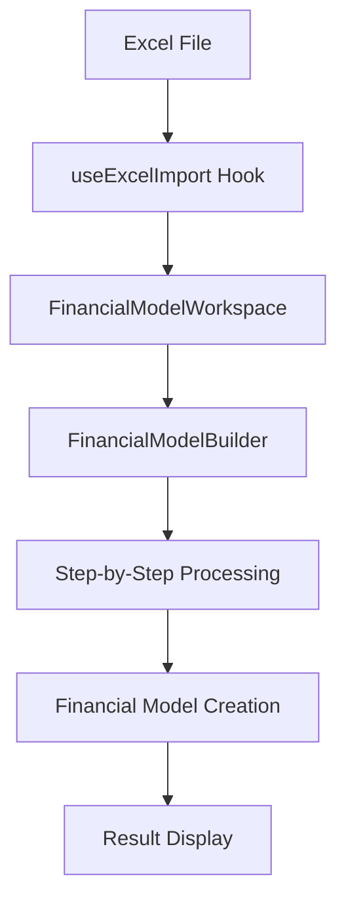

https://deepwiki.com/search/day1executive-summary_356b59e8-42e0-4dcc-a5c5-dc16574dee82

> このプロジェクトのリファクタや改修、追加機能開発を任せられているものです。Day1に、
> このプロジェクトの構造を、概要、機能目的、実装の建付けを理解し、クリティカルに内容
> を把握することが目的です。この時、ある程度の能力がある私のようなエンジニアが一通り
> 読めば直ぐにこれらを把握できるような、Executive Summaryと、それぞれの主要コンポー
> ネントに関する説明を整理してください。なるべき直感的に把握できるように努めてくださ
> い。

# 財務モデリングプロトタイプ - Executive Summary

## プロジェクト概要

このプロジェクトは**財務モデリングのWebアプリケーション**です。 [1](#0-0) Excelファイルから財務データを読み込み、勘定科目のマッピング、パラメータ設定、リレーション設定を通じて統合的な財務モデルを構築することが目的です。

## 技術スタック

- **フレームワーク**: React 18 + Vite（モダンな開発環境） [2](#0-1) 
- **UI/UX**: Material-UI、React Bootstrap、Handsontable（Excelライクなスプレッドシート機能） [3](#0-2) 
- **データ処理**: XLSX.js（Excel読み込み）、HyperFormula（計算エンジン） [4](#0-3) 

## アーキテクチャ設計

### 1. マルチステップワークフロー
アプリケーションは**7段階のステップ**で財務モデルを構築します： [5](#0-4) 

1. **勘定科目マッピング設定** - Excelデータを統一的な勘定科目にマッピング
2. **親科目設定** - 勘定科目の階層関係を定義
3. **ソート済みアカウント確認** - 最適化された勘定科目順序の確認
4. **パラメータ分類設定** - 各科目の計算ロジック（成長率、比例関係等）を設定
5. **パラメータ値設定** - 具体的なパラメータ値と参照関係を定義
6. **リレーション設定** - PPE、利益剰余金、運転資本の連携を設定
7. **集計結果確認** - 最終的な財務モデルの表示と期間追加

### 2. データフロー

## 主要コンポーネント詳細

### FinancialModelWorkspace
**役割**: アプリケーションのメインエントリポイント [6](#0-5) 
- Excelファイルの読み込み処理を管理
- タブ切り替え（データ表示 vs パラメータ設定）
- エラーハンドリングとローディング状態の管理

### FinancialModelBuilder  
**役割**: マルチステップワークフローの中核コンポーネント [7](#0-6) 
- 7段階のステップを順次処理
- 各ステップごとの専用テーブルコンポーネントを呼び出し
- 財務モデルの状態管理と更新

### useExcelImport Hook
**役割**: Excel読み込みとデータ変換の専門フック [8](#0-7) 
- 対象シート（PL、BS、CAPEX、CS）の自動識別 [9](#0-8) 
- 2次元配列への平坦化処理 [10](#0-9) 

### データモデル層

#### account.js
**役割**: 勘定科目関連の汎用処理 [11](#0-10) 
- 初期マッピングデータ生成
- 集計マップ作成
- 勘定科目のソートとプリフィックス管理

#### constants.js  
**役割**: システム全体の設定定数とマスターデータ [12](#0-11) 
- 842行にわたる詳細な勘定科目定義 [13](#0-12) 
- パラメータタイプとリレーション定義
- PL、BS、CF各表の集計科目マスター

## ビジネスロジックの特徴

### 1. 柔軟な勘定科目マッピング
Excelの様々なフォーマットに対応するため、元の勘定科目名を統一的なモデル勘定科目にマッピングする機能を提供。 [14](#0-13) 

### 2. 高度なパラメータ設定
6種類のパラメータタイプを サポート： [15](#0-14) 
- 成長率、比率、固定値、参照関係等

### 3. 財務三表の連携
PPE（固定資産）、利益剰余金、運転資本の自動連携機能により、財務三表の整合性を自動的に保持。 [16](#0-15) 

## 開発・運用面での特徴

### 開発効率性
- Viteによる高速開発環境 [17](#0-16) 
- TypeScript型定義の活用
- モジュラー設計による保守性の確保

### 拡張性
- コンポーネントベースアーキテクチャ
- 設定駆動型の勘定科目定義
- プラグイン可能な計算エンジン

## Notes

このプロジェクトは財務モデリングの専門知識を要求する高度なビジネスアプリケーションです。特に重要なのは、Excel互換性を保ちながらWeb環境で複雑な財務計算を実現している点です。コードベースは well-structured ですが、財務ドメインの深い理解が必要になります。

主な技術的課題は：
1. 大量の勘定科目定数の管理
2. 複雑な財務ロジックの実装  
3. Excel互換性の確保
4. パフォーマンス最適化

リファクタリングの際は、特に `constants.js` の勘定科目定義部分と、ステップ間のデータフロー部分に注意が必要です。
